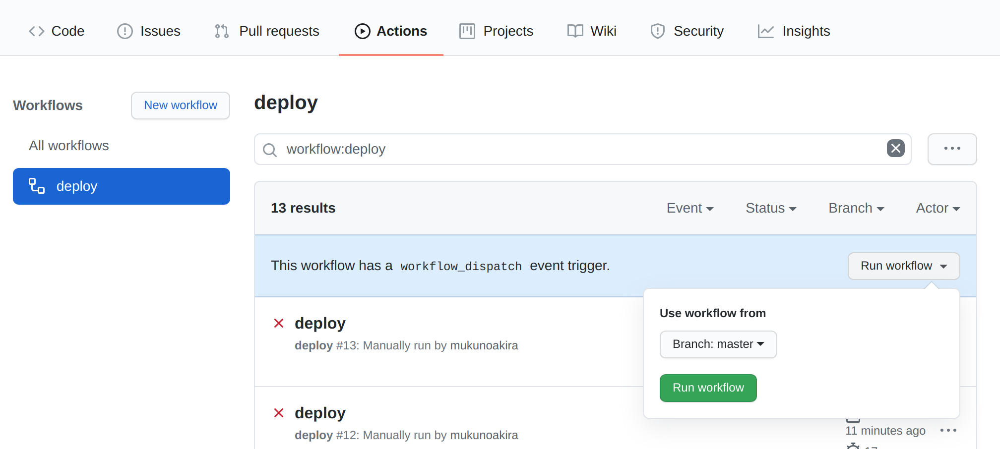
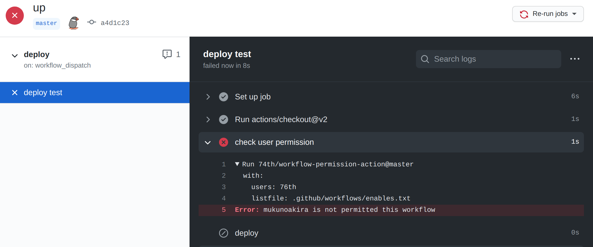

# Github action to control workflow permissions

Event workflow_dispatch is able to start workflows manually.
This action will fail when workflow is started by not permitted users.





## Input

- users: permitted user names (separated by ,)
- listfile: permitted user list file path (separated by line feed \\n)

## Sample1 list users on workflow file

```yaml
# .github/workflows/deploy.yml
name: deploy
on:
  workflow_dispatch: {}

jobs:
  deploy:
    runs-on: ubuntu-20.04
    name: deploy test
    steps:
      - name: check user permission
        uses: 74th/workflow-permission-action@1.0.0
        with:
          users: user76th,user77th,user78th
      - name: deploy
        run: echo "deployed"
```

## Sample2 using list file on repository

.github/workflows/prod-deploy-user

```
user76th
user77th
user78th
```

```yaml
# .github/workflows/deploy.yml
name: deploy
on:
  workflow_dispatch: {}

jobs:
  deploy:
    runs-on: ubuntu-20.04
    name: deploy test
    steps:
      - uses: actions/checkout@v2
      - name: check user permission
        uses: 74th/workflow-permission-action@1.0.0
        with:
          listfile: .github/workflows/prod-deploy-user
      - name: deploy
        run: echo "deployed"
```
